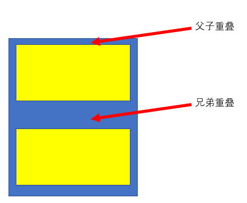

网页实际上是一个多层的结构，通过 CSS 可以分别为网页的每一个层来设置样式，而最终我们能看到只是网页的最上边一层。

## 网页中使用 CSS 的方式

- 内联样式

  在标签内部通过 style 属性来设置元素的样式。

  问题：

  - 使用内联样式，样式只能对一个标签生效，
  - 如果希望影响到多个元素必须在每一个元素中都复制一遍
  - 并且当样式发生变化时，我们必须要一个一个的修改，非常的不方便

  注意：开发时绝对不要使用内联样式

- 内部样式表

  将样式编写到 `head` 中的 `style` 标签里，然后通过 CSS 的选择器来选中元素并为其设置各种样式.可以同时为多个标签设置样式，并且修改时只需要修改一处即可全部应用。内部样式表更加方便对样式进行复用。

  问题：

  - 我们的内部样式表只能对一个网页起作用，
  - 它里边的样式不能跨页面进行复用

- 外部样式表

  可以将 CSS 样式编写到一个外部的 CSS 文件中,然后通过 `link` 标签来引入外部的 CSS 文件。

  好处：

  - 外部样式表需要通过 `link` 标签进行引入。意味着只要想使用这些样式的网页都可以对其进行引用,使样式可以在不同页面之间进行复用。
  - 将样式编写到外部的 CSS 文件中，可以使用到浏览器的缓存机制，从而加快网页的加载速度，提高用户的体验。

## 语法

### 注释

使用 `/* */` 进行注释。

### 基本语法

```css
选择器 {
  声明块
}

p {
  color: red;
  font-size: 40px;
}
```

选择器选中页面中的指定元素，声明块指定要为元素设置的样式。声明块由一个一个的声明组成。声明是一个名值对结构，一个样式名对应一个样式值，名和值之间以 `:` 连接，以 `;` 结尾 。

## 选择器

### 常用选择器

- 元素选择器

  ```css
  span {
    background-color: skyblue;
  }
  ```

- id 选择器

  ```css
  #identified {
    background-color: skyblue;
  }
  ```

- 类选择器

  ```css
  .red {
    color: #f33;
  }
  ```

- 通配选择器

  ```css
  * {
    color: red;
  }
  ```

### 复合选择器

- 交集选择器

  选中同时符合多个条件的元素。交集选择器中如果有元素选择器，必须使用元素选择器开头。

  ```css
  .red.footer {
    color: red;
  }
  ```

- 并集选择器

  选中多个选择器对应的元素，每个元素都使用定义的样式。

  ```css
  h1,
  h3 {
    font-family: sans-serif;
  }
  ```

### 关系选择器

关系选择器用于选择子元素、后代元素以及兄弟元素。

- 父元素：直接包含子元素的元素叫做父元素
- 子元素：直接被父元素包含的元素是子元素
- 祖先元素：直接或间接包含后代元素的元素叫做祖先元素。一个元素的父元素也是它的祖先元素
- 后代元素：直接或间接被祖先元素包含的元素叫做后代元素。子元素也是后代元素
- 兄弟元素：拥有相同父元素的元素是兄弟元素

关系选择器主要有：

- 子元素选择器

  选中指定父元素的指定子元素。语法为 `父元素 > 子元素 {}`

  ```css
  .box > span {
    color: orange;
  }
  ```

- 后代元素选择器

  选中指定元素内的指定后代元素。语法为 `祖先 后代 {}`

  ```css
  div span {
    color: skyblue;
  }
  ```

- 下一个兄弟选择器

  选中下一个兄弟。语法为 `前一个 + 下一个 {}`

  ```css
  p + span {
    color: red;
  }
  ```

- 下面所有兄弟选择器

  选择下面所有兄弟。语法为 `兄 ~ 弟 {}`

  ```css
  p ~ span {
    color: red;
  }
  ```

### 属性选择器

属性选择器基于标签所拥有的属性进行选择。属性选择器的语法为 `[attr] {}`、 `[attr=value] {}`等。

- [属性名] 选择含有指定属性的元素
- [属性名=属性值] 选择含有指定属性和属性值的元素
- [属性名^=属性值] 选择属性值以指定值开头的元素
- [属性名$=属性值] 选择属性值以指定值结尾的元素
- [属性名*=属性值] 选择属性值中含有某值的元素的元素

```css
[title] {
  color: orange;
}
```

### 伪类选择器

伪类指的是不存在的类，特殊的类。

伪类用来描述一个元素的特殊状态。比如：第一个子元素、被点击的元素、鼠标移入的元素等。

伪类的语法为 `:xxx`。

- 根据所有的子元素进行排序

  - `:first-child` 第一个子元素
  - `:last-child` 最后一个子元素
  - `:nth-child()` 选中第 n 个子元素
  - `:only-child` 唯一的子元素

- 根据同类型的元素进行排序

  - `:first-of-type`
  - `:last-of-type`
  - `:nth-of-type()`
  - `:only-of-type`
  - `:empty`

- :not() 否定伪类，将符合条件的元素从选择器中去除

#### `a` 标签的伪类

- `:link` 用来表示没访问过的链接（正常的链接）

  ```css
  a:link {
    color: red;
  }
  ```

- `:visited` 用来表示访问过的链接，由于隐私的原因，所以 visited 这个伪类只能修改链接的颜色

  ```css
  a:visited {
    color: orange; /* font-size: 50px; */
  }
  ```

- `:hover` 用来表示鼠标悬浮上去的状态

  ```css
  a:hover {
    color: aqua;
    font-size: 50px;
  }
  ```

- `:active` 用来表示鼠标点击

  ```css
  a:active {
    color: yellowgreen;
  }
  ```

注意，在使用时，需要遵循 **LoVe, HAte 原则**，即按照 `link`、`visited`、`hover`、`active` 这个顺序。

### 伪元素选择器

伪元素表示页面中一些特殊的并不真实的存在的元素（特殊的位置），语法为 `::XX`

- `::first-letter` 表示第一个字母
- `::first-line` 表示第一行
- `::selection` 表示选中的内容
- `::before` 元素的开始。before 和 after 必须结合 `content` 属性来使用

  ```css
  div::before {
    content: "『";
  }
  ```

- `::after` 元素的最后

### 选择器优先级

当我们通过不同的选择器，选中相同的元素，并且为相同的样式设置不同的值时，此时就发生了样式的冲突。

发生样式冲突时，应用哪个样式由选择器的权重（优先级）决定

选择器的权重为：

- `内联样式` 1,0,0,0，最高优先级
- `id选择器` 0,1,0,0，优先级第二
- `类和伪类选择器` 0,0,1,0，优先级第三
- `元素选择器` 0,0,0,1，优先级第四
- `通配选择器` 0,0,0,0，最低优先级
- `继承的样式` 没有优先级

比较优先级时，需要将所有的选择器的优先级进行相加计算，最后优先级越高，则越优先显示（分组选择器是单独计算的）。但是，选择器的累加不会超过其最大的数量级，类选择器再高也不会超过 id 选择器。

如果优先级计算后相同，此时则优先使用靠下的样式

可以在某一个样式的后边添加 `!important` ，则此时该样式会获取到最高的优先级，甚至超过内联样式。但这种方式是不推荐的。

## 样式继承

样式继承指的是我们为一个元素设置的样式同时也会应用到它的后代元素上。继承是发生在祖先后代之间的。

继承的设计是为了方便我们的开发，利用继承我们可以将一些通用的样式统一设置到共同的祖先元素上，这样只需设置一次即可让所有的元素都具有该样式

不是所有的样式都会被继承,比如背景相关的\布局相关等的这些样式都不会被继承。

## 单位

- 像素

  - 屏幕（显示器）实际上是由一个一个的小点点构成的。一个像素其实就是一个色彩块。
  - 不同屏幕的像素大小是不同的，像素越小的屏幕显示的效果越清晰
  - 所以同样的 200px 在不同的设备下显示效果不一样

- 百分比

  - 也可以将属性值设置为相对于其父元素属性的百分比
  - 设置百分比可以使子元素跟随父元素的改变而改变

- em

  - em 是相对于元素的字体大小来计算的
  - 1 em = 1 font-size
  - em 会根据字体大小的改变而改变

- rem

  - rem 是相对于根元素的字体大小来计算

在开发时，与像素有关的概念还涉及到：

- 分辨率
- 尺寸
- 像素密度

分辨率主要用于两种媒介:

- 屏幕

  以手机作为讲解。比如你买了一个手机，手机上的配置如下：

  - 主屏尺寸：5.2 英寸。指的是手机屏幕对角线的长度
  - 主屏分辨率：`1920px*1080px`。指的是屏幕上的总像素个数，也就是说，这个手机纵向上有 1920 个像素点，横向上有 1080 个像素点。
  - 屏幕像素密度：424 ppi。指的是每英寸屏幕所拥有的像素个数。

- 图片

  通过修改图片的 dpi(与 ppi 类似)，可以更改图片的尺寸。因为图片的分辨率是不会变化的。

在两种媒介中，ppi 的计算方法一致。


## 颜色

在 CSS 中，表示颜色可以用如下方法：

- 颜色名

  在 CSS 中可以直接使用颜色名来设置各种颜色。比如：red、orange、yellow、blue、green ......但是在 css 中直接使用颜色名是非常的不方便。

- RGB

  - RGB 通过三种颜色的不同浓度来调配出不同的颜色
  - R red，G green ，B blue
  - 每一种颜色的范围在 0 - 255 (0% - 100%) 之间
  - 语法：`RGB(红色数字,绿色数字,蓝色数字)`

- RGBA:

  - 就是在 RGB 的基础上增加了一个 A， 表示不透明度
  - 需要四个值，前三个和 RGB 一样，第四个表示不透明度。1 表示完全不透明，0 表示完全透明，.5 表示半透明。

- 十六进制的 RGB

  - 语法：`#红色绿色蓝色`
  - 颜色浓度通过 `00` - `ff`
  - 如果颜色两位两位重复可以进行简写

    `#aabbcc` --> `#abc`

- HSL 或 HSLA

  H 表示色相(0 - 360)，S 表示饱和度，颜色的浓度 0% - 100%，L 表示亮度，颜色的亮度 0% - 100%。语法为：`HSL(色相值,饱和度值,亮度值)`。

## 布局

### 文档流

网页是一个多层的结构，一层摞着一层。通过 CSS 可以分别为每一层来设置样式。作为用户来讲只能看到最顶上一层。这些层中，最底下的一层称为文档流。文档流是网页的基础。

我们所创建的元素默认都是在文档流中进行排列。元素主要有两个状态:

- 在文档流中

  - 块元素

    - 块元素会在页面中独占一行(**自上向下垂直排列**)
    - 默认宽度是父元素的全部（会把父元素撑满）
    - 默认高度是被内容（子元素）撑开

  - 行内元素

    - 行内元素不会独占页面的一行，只占自身的大小
    - 行内元素在页面中**自左向右水平排列**，如果一行之中不能容纳下所有的行内元素，则元素会换到第二行继续自左向右排列（这与书写习惯一致）
    - 行内元素的默认宽度和高度都是被内容撑开

- 不在文档流中（脱离文档流)

### 盒模型

CSS 将页面中的所有元素都设置为了一个矩形的盒子。也就是说，对页面的布局就变成将不同的盒子摆放到不同的位置。

每一个盒子都由由内向外由以下几个部分组成：

- 内容区（content），相当于快递盒里的物品。
- 内边距（padding），相当于快递盒盒子到物品之间的塑料泡沫。
- 边框（border），相当于快递盒盒子。
- 外边距（margin），快递盒与另外的快递盒之间的距离。

### 边框

- 边框的宽度 `border-width`

  默认值，一般都是 3 个像素。`border-width` 可以用来指定四个方向的边框的宽度值的情况：

  - 四个值：上 右 下 左
  - 三个值：上 左右 下
  - 两个值：上下 左右
  - 一个值：上下左右

  除了 `border-width`，还有一组 `border-xxx-width`，xxx 可以是 top right bottom left，用来单独指定某一个边的宽度。

- 边框的颜色 `border-color`

  `border-color` 用来指定边框的颜色。规则和 `border-width` 一样。如果省略了 `border-color`，则自动使用 `color` 的颜色值。

  可以分别指定四个边的边框颜色，语法是 `border-xxx-color`。

- 边框的样式 `border-style`

  `border-style` 指定边框的样式。主要有：

  - solid 表示实线
  - dotted 点状虚线
  - dashed 虚线
  - double 双线

  `border-style` 的默认值是 none，表示没有边框。

  可以分别指定四个边的边框样式色，语法是 `border-xxx-style`。

在开发时，我们会使用 border 简写属性来简化上面的三个属性。通过该属性可以同时设置边框所有的相关样式，并且没有顺序要求。如 `border: 10px red solid;`。

除了 border 以外，还可以使用 `border-xxx` 分别指定四个边的属性。

### 内边距

内容区和边框之间的距离是内边距。一共有四个方向的内边距：

- `padding-top`
- `padding-right`
- `padding-bottom`
- `padding-left`

内边距的设置会影响到盒子的大小,背景颜色会延伸到内边距上。所以，一个盒子的可见框的大小，由内容区、内边距、边框共同决定，在计算盒子大小时，需要将这三个区域加到一起计算。

`padding` 是内边距的简写属性，可以同时指定四个方向的内边距。

### 外边距

外边距不会影响盒子可见框的大小，但是外边距会影响盒子的位置。一共有四个方向的外边距：

- `margin-top` 上外边距，设置一个正值，元素会向下移动
- `margin-left` 左外边距，设置一个正值，元素会向右移动
- `margin-right` 默认情况下，设置此属性不会产生任何效果
- `margin-bottom` 下外边距，设置一个正值，其下边的元素会向下移动

当然，`margin` 也可以设置负值。如果是负值则元素会向相反的方向移动。

元素在页面中是按照自左向右的顺序排列的，所以默认情况下：

- 如果我们设置的左和上外边距则会移动元素自身
- 而设置下和右外边距会移动其他元素

margin 会影响到盒子实际占用空间。

`margin` 是外边距的简写属性，可以同时设置四个方向的外边距 ，用法和 padding 一样。

### 盒子的水平布局

元素在其父元素中水平方向的位置由以下几个属性，从左至右共同决定：

- `margin-left`
- `border-left`
- `padding-left`
- `width`
- `padding-right`
- `border-right`
- `margin-right`

一个元素在其父元素中，水平布局必须要满足以下的等式：

> `margin-left` + `border-left` + `padding-left` + `width` + `padding-right` + `border-right` + `margin-right` = 其父元素内容区的宽度

以上等式必须满足。

如果相加结果使等式不成立，则称为**过度约束**，则等式会自动调整。

- 如果这七个值中没有值为 auto 的情况，则浏览器会自动调整 `margin-right` 值以使等式满足

- 如果某个值为 auto，则会自动调整为 auto 的那个值以使等式成立
- 这七个值中有三个值可以设置为 auto，分别为 `width`、`margin-left`、`maring-right`

  - 如果其中某个值设为 auto，则会自动调整为 auto 的那个值以使等式成立
  - 如果将 `width` 和一个外边距（`margin-xx`）设置为 auto，则宽度会调整到最大，设置为 auto 的外边距会自动为 0
  - 如果将两个外边距设置为 auto，宽度固定值，则会将外边距设置为相同的值。我们经常利用这个特点来使一个元素在其父元素中水平居中
    示例：

    ```css
    div {
      width: 200px;
      margin: 0 auto;
    }
    ```

  - 如果将三个值都设置为 auto，则外边距都是 0，宽度最大

### 盒子的垂直布局

```html
<div class="outer">
  <div class="inner"></div>
</div>
```

子元素是在父元素的内容区中排列的：

- 当父元素未设置高度时，被内容撑开。
- 当父元素设置高度时

  - 当父元素高度大于等于内容高度时，正常显示
  - 当父元素小于内容高度时，则子元素会从父元素中溢出。在父元素中使用 `overflow` 属性，来设置父元素如何处理溢出的子元素。`overflow` 可选值：

    - `visible`，默认值 子元素会从父元素中溢出，在父元素外部的位置显示
    - `hidden` 溢出内容将会被裁剪不会显示
    - `scroll` 生成两个滚动条，通过滚动条来查看完整的内容
    - `auto` 根据需要生成滚动条

### 垂直外边距的折叠

相邻的垂直方向外边距会发生重叠现象。



- 兄弟元素

  - 如果相邻的外边距都是正值，则取两者之间的较大值
  - 如果相邻的外边距一正一负，则取两者的和
  - 如果相邻的外边距都是负值，则取两者中绝对值较大的

  兄弟元素之间的外边距的重叠，对于开发是有利的，所以我们不需要进行处理。

- 父子元素

  父子元素间相邻外边距，子元素的会传递给父元素（上外边距）。父子外边距的折叠会影响到页面的布局，必须要进行处理。

### 行内元素的盒模型

- 行内元素不支持设置宽度和高度，盒子的大小由内容区撑开决定
- 行内元素可以设置 padding，但是垂直方向 padding 不会影响页面的布局
- 行内元素可以设置 border，垂直方向的 border 不会影响页面的布局
- 行内元素可以设置 margin，垂直方向的 margin 不会影响布局

关于盒模型，涉及到两个重要的属性：

- `display` 用来设置元素显示的类型：

  - `inline` 将元素设置为行内元素
  - `block` 将元素设置为块元素
  - `inline-block` 将元素设置为行内块元素,既可以设置宽度和高度又不会独占一行。开发中，尽量避免使用。
  - `table` 将元素设置为一个表格
  - `none` 元素不在页面中显示

- `visibility` 用来设置元素的显示状态

  - `visible` 默认值，元素在页面中正常显示
  - `hidden` 元素在页面中隐藏 不显示，但是依然占据页面的位置

### 默认样式

通常情况，浏览器都会为元素设置一些默认样式。默认样式的存在会影响到页面的布局。通常情况下，编写网页时必须要去除浏览器的默认样式（PC 端的页面）。

重置样式表专门用来对浏览器的样式进行重置的。主要有两种：

- `reset.css` 直接去除了浏览器的默认样式
- `normalize.css` 直接去除了浏览器的默认样式，在此基础上，对默认样式进行了统一

### 盒子的尺寸

默认情况下，盒子可见框的大小由内容区、内边距和边框共同决定。这是由 `box-sizing` 属性决定的。

`box-sizing` 用来设置盒子尺寸的计算方式（设置 width 和 height 的作用）。可选值：

- `content-box` 默认值，宽度和高度用来设置内容区的大小
- `border-box` 宽度和高度用来设置整个盒子可见框的大小，在这种情况下，width 和 height 指的是内容区、内边距、边框的总大小。

### 轮廓和圆角

- `outline`： 用来设置元素的轮廓线，用法和 `border` 一模一样。轮廓和边框不同的点就是轮廓不会影响到可见框的大小。也就是说，不会影响布局。
- `box-shadow`： 用来设置元素的阴影效果，阴影不会影响页面布局。参数列表：

  第一个值 水平偏移量 设置阴影的水平位置 正值向右移动 负值向左移动

  第二个值 垂直偏移量 设置阴影的水平位置 正值向下移动 负值向上移动

  第三个值 阴影的模糊半径

  第四个值 阴影的颜色

- `border-radius`：用来设置圆角，也就是设置的圆的半径。

  border-radius 可以分别指定四个角的圆角：

  - 四个值：`左上`、`右上`、`右下`、`左下`
  - 三个值：`左上`、`右上/左下`、`右下`
  - 两个值：`左上/右下`、`右上/左下`
  - 一个值：`左上/右下/右上/左下`

  `border-radius: 20px / 40px;` 设置椭圆
  `border-radius: 50%;` 设置圆

  也可以分别指定：

  - `border-top-left-radius`
  - `border-top-right-radius`
  - `border-bottom-left-radius`
  - `border-bottom-right-radius`
  - `border-top-left-radius`

## float

### 浮动的简介

通过浮动可以使一个元素向其父元素的左侧边界或右侧边界移动。使用 `float` 属性来设置元素的浮动。可选值：

- `none` 默认值 ，元素不浮动
- `left` 元素向左浮动
- `right` 元素向右浮动

注意，元素设置浮动以后，文档流中要求的水平布局的等式便不需要强制成立。元素设置浮动以后，会完全从文档流中脱离，不再占用文档流的位置，所以元素下边的还在文档流中的元素会自动向上移动。

浮动的特点：

- 浮动元素会完全脱离文档流，不再占据文档流中的位置
- 设置浮动以后元素会向父元素的左侧或右侧移动，
- 浮动元素默认不会从父元素中移出
- 浮动元素向左或向右移动时，不会超过它前边的其他浮动元素
- 如果浮动元素的上边是一个没有浮动的块元素，则浮动元素无法上移
- 浮动元素不会超过它上边的浮动的兄弟元素，最多最多就是和它一样高

简单总结：浮动目前来讲它的主要作用就是让页面中的元素可以水平排列，通过浮动可以制作一些水平方向的布局。

浮动元素不会盖住文字，文字会自动环绕在浮动元素的周围，所以我们可以利用浮动来设置文字环绕图片的效果。

元素设置浮动以后，将会从文档流中脱离，从文档流中脱离后，元素的一些特点也会发生变化：

- 块元素

  - 块元素不再独占页面的一行
  - 脱离文档流以后，块元素的宽度和高度默认都被内容撑开

- 行内元素

  行内元素脱离文档流以后会变成块元素，特点和块元素一样

也就是说，脱离文档流以后，不需要再区分块和行内了。

### 高度塌陷

在浮动布局中，父元素的高度默认是被子元素撑开的，当子元素浮动后，其会完全脱离文档流，子元素从文档流中脱离，将会无法撑起父元素的高度，导致父元素的高度丢失。

父元素高度丢失以后，其下的元素会自动上移，导致页面的布局混乱,所以高度塌陷是浮动布局中比较常见的一个问题，这个问题我们必须要进行处理！

### BFC

BFC(Block Formatting Context) 是一个 CSS 中的一个隐含的属性。元素开启 BFC 后，该元素会变成一个独立的布局区域 -

元素开启 BFC 后的特点：

1. 开启 BFC 的元素不会被浮动元素所覆盖
2. 开启 BFC 的元素子元素和父元素外边距不会重叠
3. 开启 BFC 的元素可以包含浮动的子元素

开启元素 BFC 的方式：

1. 设置元素的浮动（不推荐）
2. 将元素设置为行内块元素（不推荐）
3. 将元素的 overflow 设置为一个非 visible 的值。最常用的方式，为元素设置 `overflow:hidden`，开启其 BFC 以使其可以包含浮动元素

### clear

如果我们不希望某个元素因为其他元素浮动的影响而改变位置，可以通过 `clear` 属性来清除浮动元素对当前元素所产生的影响。

`clear` 属性用于清除浮动元素对当前元素所产生的影响。可选值：

- `lef`t 清除左侧浮动元素对当前元素的影响
- `right` 清除右侧浮动元素对当前元素的影响
- `both` 清除两侧中最大影响的那侧

原理：设置清除浮动以后，浏览器会自动为元素添加一个上外边距，以使其位置不受其他元素的影响

### clearfix

clearfix 这个样式可以同时解决**高度塌陷**和**外边距重叠**的问题，当你在遇到这些问题时，直接使用 clearfix 这个类即可。

```css
.clearfix::before,
.clearfix::after {
  content: "";
  display: table;
  clear: both;
}
```

## position

定位（position）是一种更加高级的布局手段。通过定位可以将元素摆放到页面的任意位置。使用 `position` 属性来设置定位，可选值有：

- `static` 默认值，表示元素是静止的，没有开启定位
- `relative` 开启元素的相对定位
- `absolute` 开启元素的绝对定位
- `fixed` 开启元素的固定定位
- `sticky` 开启元素的粘滞定位

### relative 相对定位

当元素的 `position` 属性值设置为 `relative` 时，则开启了元素的相对定位。

相对定位的特点：

- 元素开启相对定位以后，如果不设置偏移量，元素不会发生任何的变化
- 相对定位是参照于**元素自身**在文档流中的位置进行定位的
- 相对定位会提升元素的层级
- 相对定位不会使元素脱离文档流
- 相对定位不会改变元素的性质，也就是说，块元素还是块元素，行内元素还是行内元素

当元素开启了定位以后，可以通过设置偏移量来设置元素的位置。偏移量有 4 个属性：

- 垂直方向：垂直方向的位置由 `top` 和 `bottom` 两个属性来控制，通常情况下我们只会使用其中之一。

  - `top` 定位元素和定位位置上边的距离。`top` 值越大，定位元素越向下移动
  - `bottom` 定位元素和定位位置下边的距离。`bottom` 值越大，定位元素越向上移动

- 水平方向：水平方向的位置由 `left` 和 `right` 两个属性控制，通常情况下我们只会使用其中之一。

  - `left` 定位元素和定位位置的左侧距离。`left` 越大元素越靠右
  - `right` 定位元素和定位位置的右侧距离.`right` 越大元素越靠左

### absolute 绝对定位

当元素的 `position` 属性值设置为 `absolute` 时，则开启了元素的绝对定位。

绝对定位的特点：

- 开启绝对定位后，如果不设置偏移量，元素的位置不会发生变化
- 开启绝对定位后，元素会**从文档流中脱离**
- 绝对定位会改变元素的性质，行内元素变成块元素，块元素的宽高被内容撑开
- 绝对定位会使元素提升一个层级
- 绝对定位元素是相对于其**包含块**进行定位的

包含块( containing block )就是子元素的祖先块元素：

- 正常情况下，包含块就是离当前元素最近的祖先块元素
- 绝对定位的包含块:包含块就是离它最近的开启了定位（也就是说，`position` 值不为 `static`）的祖先元素。如果所有的祖先元素都没有开启定位，则根元素就是它的包含块。

绝对定位的水平布局一定要满足 `left + margin-left + border-left + padding-left + width + padding-right + border-right + margin-right + right = 包含块的内容区的宽度` 这个等式。

当我们开启了绝对定位后，水平方向的布局等式类似于文档流的水平布局等式，但是额外添加了 left 和 right 两个值。

当发生过度约束：

- 如果 9 个值中没有 auto， 则自动调整 right 值以使等式满足
- 如果有 auto，则自动调整 auto 的值，以使等式满足。可设置 auto 的值有：`margin`、`width`、`left`、`right`。因为 left 和 right 的值默认是 auto，所以如果不指定 left 和 right 且等式不满足时，会自动调整这两个值

垂直方向布局的等式的也必须要满足 `top + margin-top/bottom + padding-top/bottom + border-top/bottom + height = 包含块的高度` 这个等式。

### fixed 固定定位

将元素的 `position` 属性设置为 `fixed`，则开启了元素的固定定位。固定定位也是一种绝对定位，所以固定定位的大部分特点都和绝对定位一样。唯一不同的是固定定位永远参照于**浏览器的视口进行定位**。

### sticky 粘滞定位

当元素的 `position` 属性设置为 `sticky` 时则开启了元素的粘滞定位。粘滞定位和相对定位的特点基本一致，不同的是粘滞定位可以在元素到达某个位置时将其固定。

### z-index 元素层级

对于开启了定位元素，可以通过 `z-index` 属性来指定元素的层级。`z-index` 需要一个整数作为参数，值越大元素的层级越高，元素的层级越高越优先显示：

- 如果元素的层级一样，则优先显示靠下的元素
- 祖先的元素的层级再高也不会盖住后代元素

## 字体

字体相关的样式：

- `color` 用来设置字体颜色
- `font-size` 字体的大小
- `font-family` 字体族（字体的格式）。可选值：

  - `serif` 衬线字体族
  - `sans-serif` 非衬线字体族
  - `monospace` 等宽字体族
  - `某种特定的字体`

  指定字体的类别后，运行浏览器的电脑上如果有这种字体，就会自动使用该类别下的字体。`font-family` 可以同时指定多个字体，多个字体间使用 `,` 隔开。字体生效时优先使用第一个，第一个无法使用则使用第二个，以此类推。

- `font-face` 可以将服务器中的字体直接提供给用户去使用。

  ```css
  @font-face {
    font-family: "my-font";
    src: url("./font/ZCOOLKuaiLe-Regular.ttf") format("truetype");
  }

  font-family: myfont;
  ```

  使用 `font-face` 存在的问题：

  - 加载速度：由于要从服务器下载，如果网速慢，会发现字体会有一个变化过程。
  - 版权：很多字体是收费的。由于用户是在你的服务器上下载的，所以你的服务器侵犯了字体作者的知识产权。
  - 字体格式：老的浏览器可能识别不了。

## 图标字体

在网页中经常需要使用一些图标，可以通过图片来引入图标，但是图片大小本身比较大，并且非常的不灵活。在使用图标时，我们还可以将图标直接设置为字体，然后通过 `font-face` 的形式来对字体进行引入。这样我们就可以通过使用字体的形式来使用图标。

比较有名的图标字体库是 `fontawesome`。 使用步骤为：

1. [下载](https://fontawesome.com/)
2. 解压
3. 将 css 和 webfonts 移动到项目中
4. 将 all.css 引入到网页中
5. 使用图标字体

   - 直接通过类名来使用图标字体

     ```css
     <i class="fas fa-cat"></i>
     ```

   - 通过伪元素来设置图标字体

     1. 通过 before 或 after 选中要设置图标的元素
     2. 在 content 中设置字体的编码
     3. 设置字体的样式

     ```css
     li::before {
       content: "\f1b0";
       font-family: "Font Awesome 5 Brands";
     }
     ```

   - 通过实体来使用图标字体，语法为 `&#x图标的编码;`。

     ```html
     <span class="fas">&#xf0f3;</span>
     ```

## 行高

行高指的是文字占有的实际高度。通过 `line-height` 来设置行高。行高可以直接指定一个大小（px em），也可以直接为行高设置一个整数， 如果是一个整数的话，行高将会是 `font-size`（字体大小） 的指定的倍数。

字体框就是字体存在的格子，设置 `font-size` 实际上就是在设置字体框的高度，行高会在字体框的上下平均分配。

可以将行高(line-height)设置为和高度(height)一样的值，使单行文字在一个元素中垂直居中。

行高还能用来设置文字的行间距，`行间距 = 行高 - 字体大小`。

## 字体其他

`font-weight` 字重 字体的加粗。可选值：

- `normal` 默认值 不加粗
- `bold` 加粗

`font-style` 字体的风格。可选值有：

- `normal` 正常的
- `italic` 斜体

## 文本的样式

- `text-align` 文本的水平对齐。可选值：

  - `left` 左侧对齐
  - `right` 右对齐
  - `center` 居中对齐
  - `justify` 两端对齐

- `vertical-align` 设置子元素相对于父元素的垂直对齐的方式。可选值：

  - `baseline` 默认值 基线对齐
  - `top` 顶部对齐
  - `bottom` 底部对齐
  - `middle` 居中对齐

- `text-decoration` 设置文本修饰。可选值：

  - `none` 什么都没有
  - `underline` 下划线
  - `line-through` 删除线
  - `overline` 上划线

- `white-space` 设置网页如何处理空白。可选值：

  - `normal` 正常
  - `nowrap` 不换行
  - `pre` 保留空白

## 背景

- `background-color` 设置背景颜色
- `background-image` 设置背景图片

  可以同时设置背景图片和背景颜色，这样背景颜色将会成为图片的背景色。如果背景的图片小于元素，则背景图片会自动在元素中平铺将元素铺满；如果背景的图片大于元素，将会一个部分背景无法完全显示；如果背景图片和元素一样大，则会直接正常显示。

  通过渐变可以设置一些复杂的背景颜色，可以实现从一个颜色向其他颜色过渡的效果。渐变是图片，需要通过 `background-image` 来设置。

  - `linear-gradient` 线性渐变，颜色沿着一条直线发生变化
  - `radial-gradient` 径向渐变(放射性的效果)

- `background-repeat` 用来设置背景的重复方式。可选值：

  - `repeat` 默认值 ， 背景会沿着 x 轴 y 轴双方向重复
  - `repeat-x` 沿着 x 轴方向重复
  - `repeat-y` 沿着 y 轴方向重复
  - `no-repeat` 背景图片不重复

- `background-position` 用来设置背景图片的位置。

  - 通过 top left right bottom center 几个表示方位的词来设置背景图片的位置。使用方位词时必须要同时指定两个值，如果只写一个则第二个默认就是 center。
  - 通过偏移量来指定背景图片的位置：水平方向的偏移量，垂直方向变量。

- 设置背景的范围

  - `background-clip` 可选值：

    - `border-box` 默认值，背景会出现在边框的下边
    - `padding-box` 背景不会出现在边框，只出现在内容区和内边距
    - `content-box` 背景只会出现在内容区

  - `background-origin` 背景图片的偏移量计算的原点
    - `padding-box` 默认值，background-position 从内边距处开始计算
    - `content-box` 背景图片的偏移量从内容区处计算
    - `border-box` 背景图片的变量从边框处开始计算

- `background-size` 设置背景图片的大小。

  - 第一个值表示宽度，第二个值表示高度。如果只写一个，则第二个值默认是 auto
  - cover 图片的比例不变，将元素铺满
  - contain 图片比例不变，将图片在元素中完整显示

- `background-attachment` 背景图片是否跟随元素移动。可选值：

  - `scroll` 默认值 背景图片会跟随元素移动
  - `fixed` 背景会固定在页面中，不会随元素移动

图片属于网页中的外部资源，外部资源都需要浏览器单独发送请求加载，浏览器加载外部资源时是按需加载的，用则加载，不用则不加载。

可以将多个小图片统一保存到一个大图片中，然后通过调整 `background-position` 来显示的图片，这样图片会同时加载到网页中 就可以有效的避免出现闪烁的问题。这个技术在网页中应用十分广泛，被称为 CSS-Sprite，也就是雪碧图。

## 表格样式

- `border-spacing` 指定边框之间的距离
- `border-collapse` 设置边框的合并
