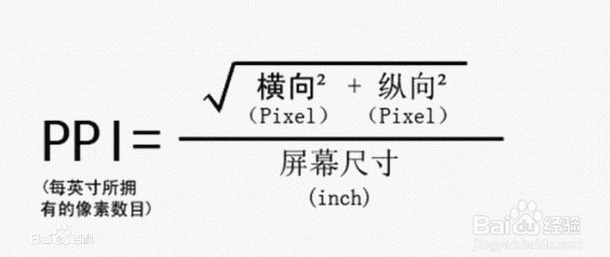

# 单位

- 像素

  - 屏幕（显示器）实际上是由一个一个的小点点构成的。一个像素其实就是一个色彩块。
  - 不同屏幕的像素大小是不同的，像素越小的屏幕显示的效果越清晰
  - 所以同样的 200px 在不同的设备下显示效果不一样

- 百分比

  - 也可以将属性值设置为相对于其父元素属性的百分比
  - 设置百分比可以使子元素跟随父元素的改变而改变

- em

  - em 是相对于元素的字体大小来计算的
  - 1 em = 1 font-size
  - em 会根据字体大小的改变而改变

- rem

  - rem 是相对于根元素的字体大小来计算

在开发时，与像素有关的概念还涉及到：

- 分辨率
- 尺寸
- 像素密度

分辨率主要用于两种媒介:

- 屏幕

  以手机作为讲解。比如你买了一个手机，手机上的配置如下：

  - 主屏尺寸：5.2 英寸。指的是手机屏幕对角线的长度
  - 主屏分辨率：`1920px*1080px`。指的是屏幕上的总像素个数，也就是说，这个手机纵向上有 1920 个像素点，横向上有 1080 个像素点。
  - 屏幕像素密度：424 ppi。指的是每英寸屏幕所拥有的像素个数。

- 图片

  通过修改图片的 dpi(与 ppi 类似)，可以更改图片的尺寸。因为图片的分辨率是不会变化的。

在两种媒介中，ppi 的计算方法一致。

