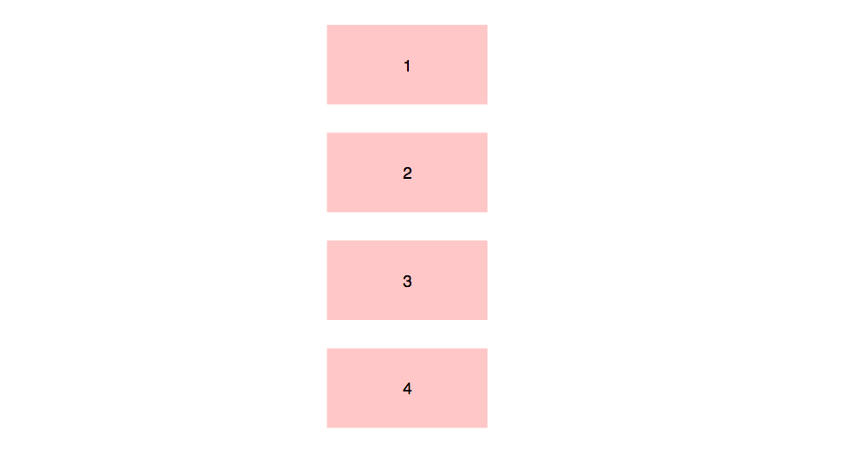
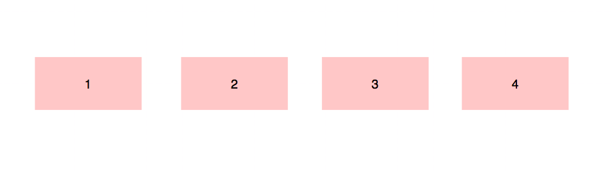

# 正常流

正常流排版行为就是依次排列，排不下了换行。

## 盒模型

CSS 将页面中的所有元素都设置为了一个矩形的盒子。也就是说，对页面的布局就变成将不同的盒子摆放到不同的位置。

每一个盒子都由由内向外由以下几个部分组成：

- 内容区（content），相当于快递盒里的物品。
- 内边距（padding），相当于快递盒盒子到物品之间的塑料泡沫。
- 边框（border），相当于快递盒盒子。
- 外边距（margin），快递盒与另外的快递盒之间的距离。

关于盒模型，涉及到两个重要的属性：

- `display` 用来设置元素显示的类型：

  - `inline` 将元素设置为行内元素
  - `block` 将元素设置为块元素
  - `inline-block` 将元素设置为行内块元素,既可以设置宽度和高度又不会独占一行。开发中，尽量避免使用。
  - `table` 将元素设置为一个表格
  - `none` 元素不在页面中显示

- `visibility` 用来设置元素的显示状态

  - `visible` 默认值，元素在页面中正常显示
  - `hidden` 元素在页面中隐藏 不显示，但是依然占据页面的位置

### 边框

- 边框的宽度 `border-width`

  默认值，一般都是 3 个像素。`border-width` 可以用来指定四个方向的边框的宽度值的情况：

  - 四个值：上 右 下 左
  - 三个值：上 左右 下
  - 两个值：上下 左右
  - 一个值：上下左右

  除了 `border-width`，还有一组 `border-xxx-width`，xxx 可以是 top right bottom left，用来单独指定某一个边的宽度。

- 边框的颜色 `border-color`

  `border-color` 用来指定边框的颜色。规则和 `border-width` 一样。如果省略了 `border-color`，则自动使用 `color` 的颜色值。

  可以分别指定四个边的边框颜色，语法是 `border-xxx-color`。

- 边框的样式 `border-style`

  `border-style` 指定边框的样式。主要有：

  - solid 表示实线
  - dotted 点状虚线
  - dashed 虚线
  - double 双线

  `border-style` 的默认值是 none，表示没有边框。

  可以分别指定四个边的边框样式色，语法是 `border-xxx-style`。

在开发时，我们会使用 border 简写属性来简化上面的三个属性。通过该属性可以同时设置边框所有的相关样式，并且没有顺序要求。如 `border: 10px red solid;`。

除了 border 以外，还可以使用 `border-xxx` 分别指定四个边的属性。

### 内边距

内容区和边框之间的距离是内边距。一共有四个方向的内边距：

- `padding-top`
- `padding-right`
- `padding-bottom`
- `padding-left`

内边距的设置会影响到盒子的大小,背景颜色会延伸到内边距上。所以，一个盒子的可见框的大小，由内容区、内边距、边框共同决定，在计算盒子大小时，需要将这三个区域加到一起计算。

`padding` 是内边距的简写属性，可以同时指定四个方向的内边距。

### 外边距

外边距不会影响盒子可见框的大小，但是外边距会影响盒子的位置。一共有四个方向的外边距：

- `margin-top` 上外边距，设置一个正值，元素会向下移动
- `margin-left` 左外边距，设置一个正值，元素会向右移动
- `margin-right` 默认情况下，设置此属性不会产生任何效果
- `margin-bottom` 下外边距，设置一个正值，其下边的元素会向下移动

当然，`margin` 也可以设置负值。如果是负值则元素会向相反的方向移动。

元素在页面中是按照自左向右的顺序排列的，所以默认情况下：

- 如果我们设置的左和上外边距则会移动元素自身
- 而设置下和右外边距会移动其他元素

margin 会影响到盒子实际占用空间。

`margin` 是外边距的简写属性，可以同时设置四个方向的外边距 ，用法和 padding 一样。

## 块元素盒模型

### 盒子的水平布局

元素在其父元素中水平方向的位置由以下几个属性，从左至右共同决定：

- `margin-left`
- `border-left`
- `padding-left`
- `width`
- `padding-right`
- `border-right`
- `margin-right`

一个元素在其父元素中，水平布局必须要满足以下的等式：

> `margin-left` + `border-left` + `padding-left` + `width` + `padding-right` + `border-right` + `margin-right` = 其父元素内容区的宽度

以上等式必须满足。

如果相加结果使等式不成立，则称为**过度约束**，则等式会自动调整。

- 如果这七个值中没有值为 auto 的情况，则浏览器会自动调整 `margin-right` 值以使等式满足

- 如果某个值为 auto，则会自动调整为 auto 的那个值以使等式成立
- 这七个值中有三个值可以设置为 auto，分别为 `width`、`margin-left`、`maring-right`

  - 如果其中某个值设为 auto，则会自动调整为 auto 的那个值以使等式成立
  - 如果将 `width` 和一个外边距（`margin-xx`）设置为 auto，则宽度会调整到最大，设置为 auto 的外边距会自动为 0
  - 如果将两个外边距设置为 auto，宽度固定值，则会将外边距设置为相同的值。我们经常利用这个特点来使一个元素在其父元素中水平居中
    示例：

    ```css
    div {
      width: 200px;
      margin: 0 auto;
    }
    ```

  - 如果将三个值都设置为 auto，则外边距都是 0，宽度最大

### 盒子的垂直布局

```html
<div class="outer">
  <div class="inner"></div>
</div>
```

子元素是在父元素的内容区中排列的：

- 当父元素未设置高度时，被内容撑开。
- 当父元素设置高度时

  - 当父元素高度大于等于内容高度时，正常显示
  - 当父元素小于内容高度时，则子元素会从父元素中溢出。在父元素中使用 `overflow` 属性，来设置父元素如何处理溢出的子元素。`overflow` 可选值：

    - `visible`，默认值 子元素会从父元素中溢出，在父元素外部的位置显示
    - `hidden` 溢出内容将会被裁剪不会显示
    - `scroll` 生成两个滚动条，通过滚动条来查看完整的内容
    - `auto` 根据需要生成滚动条

### 垂直外边距的折叠

相邻的垂直方向外边距会发生重叠现象。


- 兄弟元素

  - 如果相邻的外边距都是正值，则取两者之间的较大值
  - 如果相邻的外边距一正一负，则取两者的和
  - 如果相邻的外边距都是负值，则取两者中绝对值较大的

  兄弟元素之间的外边距的重叠，对于开发是有利的，所以我们不需要进行处理。

- 父子元素

  父子元素间相邻外边距，子元素的会传递给父元素（上外边距）。父子外边距的折叠会影响到页面的布局，必须要进行处理。

## 行内元素盒模型

- 行内元素不支持设置宽度和高度，盒子的大小由内容区撑开决定
- 行内元素可以设置 padding，但是垂直方向 padding 不会影响页面的布局
- 行内元素可以设置 border，垂直方向的 border 不会影响页面的布局
- 行内元素可以设置 margin，垂直方向的 margin 不会影响布局

## 盒子的尺寸

默认情况下，盒子可见框的大小由内容区、内边距和边框共同决定。这是由 `box-sizing` 属性决定的。

`box-sizing` 用来设置盒子尺寸的计算方式（设置 width 和 height 的作用）。可选值：

- `content-box` 默认值，宽度和高度用来设置内容区的大小
- `border-box` 宽度和高度用来设置整个盒子可见框的大小，在这种情况下，width 和 height 指的是内容区、内边距、边框的总大小。

## 轮廓和圆角

- `outline`： 用来设置元素的轮廓线，用法和 `border` 一模一样。轮廓和边框不同的点就是轮廓不会影响到可见框的大小。也就是说，不会影响布局。
- `box-shadow`： 用来设置元素的阴影效果，阴影不会影响页面布局。参数列表：

  第一个值 水平偏移量 设置阴影的水平位置 正值向右移动 负值向左移动

  第二个值 垂直偏移量 设置阴影的水平位置 正值向下移动 负值向上移动

  第三个值 阴影的模糊半径

  第四个值 阴影的颜色

- `border-radius`：用来设置圆角，也就是设置的圆的半径。

  border-radius 可以分别指定四个角的圆角：

  - 四个值：`左上`、`右上`、`右下`、`左下`
  - 三个值：`左上`、`右上/左下`、`右下`
  - 两个值：`左上/右下`、`右上/左下`
  - 一个值：`左上/右下/右上/左下`

  `border-radius: 20px / 40px;` 设置椭圆
  `border-radius: 50%;` 设置圆

  也可以分别指定：

  - `border-top-left-radius`
  - `border-top-right-radius`
  - `border-bottom-left-radius`
  - `border-bottom-right-radius`
  - `border-top-left-radius`

## 原理

正常流的排版过程是**格式化上下文 + 盒 / 文字 = 位置**。

格式化上下文分为块级和行内级。

块级上下文排列规则：



行内级上下文排列规则：



所以，正常流排版时：

- 当遇到块级盒，排入块级格式化上下文
- 当遇到行内级盒或文字，首先尝试排入行内级格式化上下文，如果排不下，那么创建一个行盒，先将行盒排版（行盒是块级，所以到第一种情况），行盒会创建一个行内级格式化上下文
- 遇到 float 盒，把盒的顶部跟当前行内级上下文上边缘对齐，然后根据 float 的方向把盒的对应边缘对到块级格式化上下文的边缘，之后重排当前行盒
